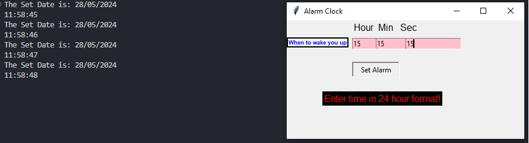

# Alarm

This Python script creates a simple alarm clock using the Tkinter GUI library. It allows users to set an alarm time and plays a sound when the set time is reached.


## Table of Contents

- [Installation](#installation)
- [Features](#features)
- [Usage](#usage)
- [Configuration](#configuration)
- [Contributing](#contributing)
- [License](#license)

## Installation

Install Python: Make sure you have Python installed on your system.

No additional libraries required: This script only requires the built-in Tkinter library, which comes pre-installed with Python.

## Features
<ul><li>Set an alarm time in the format (Hour:Minute:Seconds).</li>
<li>Displays the current time and date.</li>
<li>Plays a sound when the alarm time is reached.</li></ul>

## Usage

1. Run the Script: Execute the script using Python:
```bash
python Alarm.py
```
2. Set the Alarm: Enter the desired alarm time in the format (Hour:Minute:Seconds) and click the "Set Alarm" button.

3. Wait for Alarm: The script will continuously monitor the current time. Once the set alarm time is reached, a sound will play to alert you.

## Contributing
Contributions are welcome! If you'd like to contribute to this project, please follow these steps:

1. Fork this repository.
2. Create a branch:
```bash
git checkout -b feature/new-feature
```
3. Commit your changes:
```bash
git commit -m 'Add some feature'
```
4. Push to the branch:
```bash
git push origin feature/new-feature
```
5. Create a pull request.

## License
This project is licensed under the MIT License.
